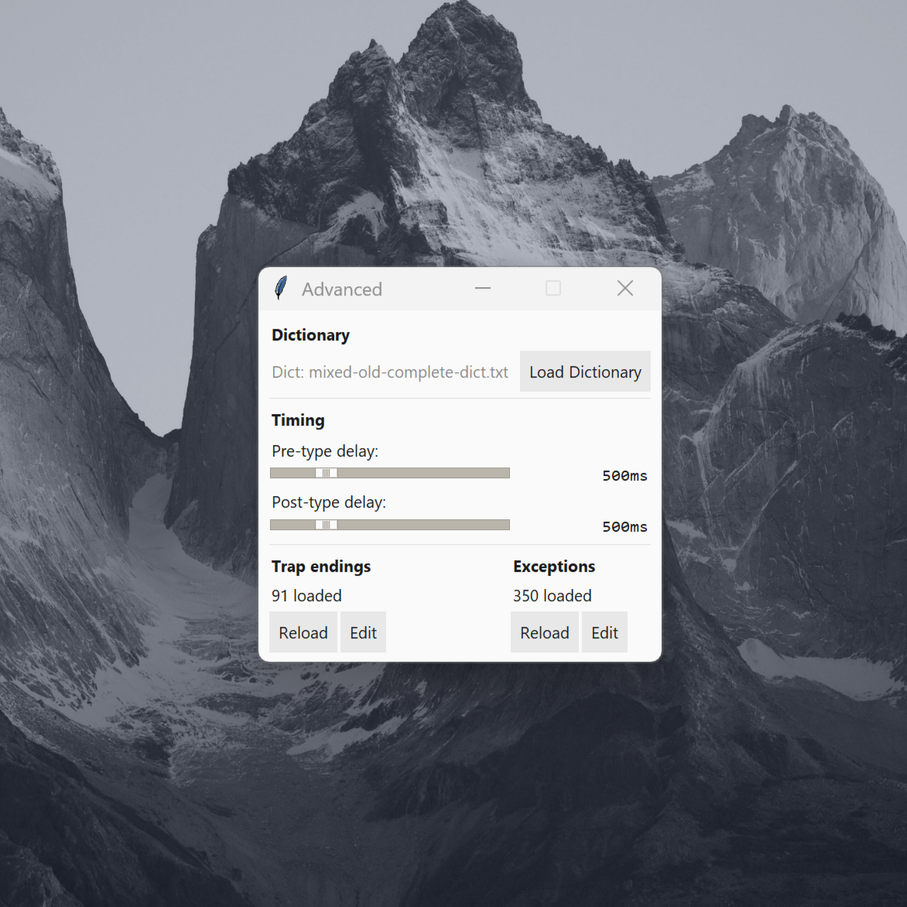
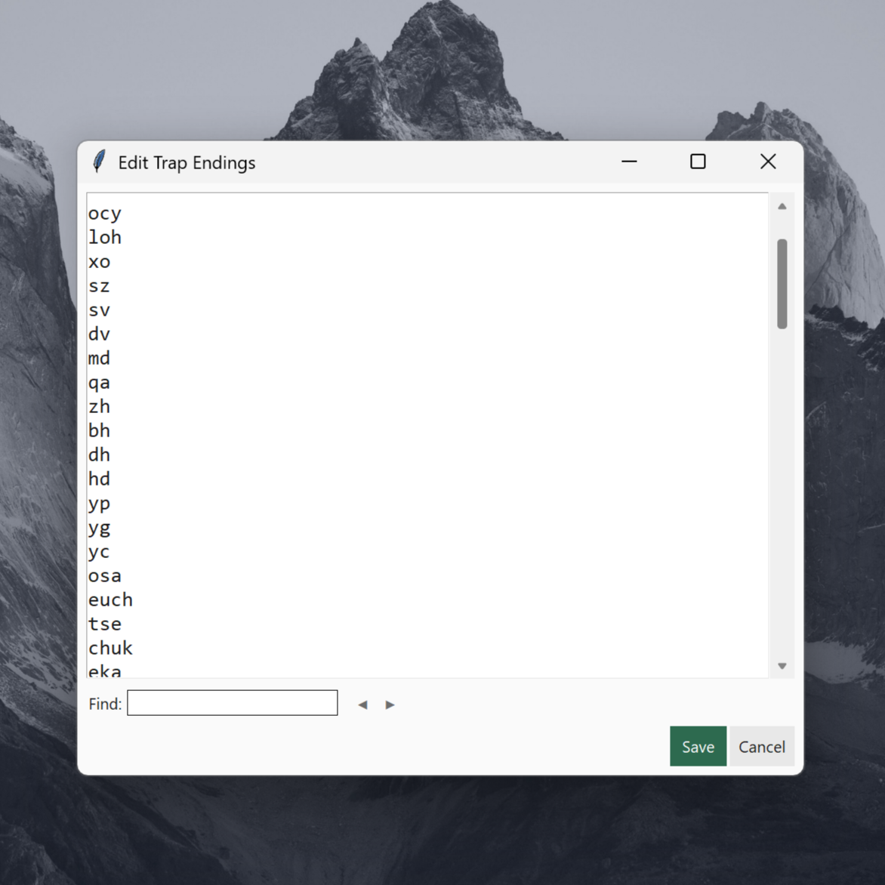

# Letter Demon 😈

> **The Demon knows every word your opponent doesn't.**

A pragmatic tool that searches 477k+ words in milliseconds, picks the hardest follow-up, and types it like a human.

Why? The game's suffix matching system rewards dead-end patterns over vocabulary. This tool weaponizes that flaw.

> **No dictionary is included.** This tool expects you to supply your own word list — ideally one around 474k-477k entries that the game use. Anything smaller and the magic fades.


## Features

### 1. Strategy + Backup

Pick a main strategy, then a backup for when things go sideways.

- **Trap** → Lead your opponent into a dead end.
- **Long** → To boost your ego by pretending you know obscure, ridiculously long words.
- **Short** → Minimal effort, maximum efficiency.
- **Random** → Let fate take the wheel.

### 2. Typing That Feels Human

Typing speed ranges from 10-250 ms per keystroke.

Turn up the humanizer and the typing stops feeling like a machine gun and starts feeling like an actual person. A little hesitation here, a weird pause there, enough imperfection to look natural.

At around **170 ms** with **75%+ humanization** in **Trap** mode, it starts looking suspiciously like a real player who somehow knows every obscure word in the dictionary.

### 3. You're Still the Boss

The app suggests. You decide.

- Block words you never want to use.
- Create custom trap endings.
- Edit everything in an inline editor with search and undo.
- Keep a log of every word played.

## Installation

Windows, Python 3.10+. Run:

```bash
git clone https://github.com/n6ufal/Letter-Demon.git
cd letter-demon
pip install -r requirements.txt
python main.pyw
```

## Quick Start

1. **Load a Dictionary** - Advanced > Load Dictionary, pick a .json or .txt file. Indexing takes 5-30s depending on your system specs.
2. **Configure Typing** - Set speed (default 170ms), jitter/humanizer intensity (default 75%), pre/post delays (default 500ms each).
3. **Pick Strategy** - Trap Words (hardest), Long Words, Short Words, or Random. Choose a fallback.
4. **Play** - Type starting letters, press Play or Ctrl+Enter.

### Example Workflow

You type "ca" at the start of a game. The engine:

1. Searches all words starting with "ca" (cabinet, camera, capital, etc.)
2. Scores each by matching trap endings (suffix priority list)
3. Picks the highest-scoring word that's not in exceptions
4. Types it like a human with realistic keystroke delays

Result: "cabinet" gets typed with delays that look natural.

## Configuration

<details>
<summary><b>Dictionary Format</b></summary>

**JSON:**

```json
{
  "words": ["apple", "banana", "cherry"]
}
```

**Text (one word per line):**

```
apple
banana
cherry
```

</details>

<details>
<summary><b>Advanced Configuration</b></summary>



#### Custom Trap Endings

Trap endings are suffixes that are statistically hard to continue from. The engine scores each word by its longest matching suffix, prioritizing earlier entries in `trap_endings.txt`.

To load trap endings:

1. Click Advanced > Load (Trap Endings section)
2. Select `data/trap_endings.txt`
3. Changes take effect immediately

Format: one suffix per line, ordered by difficulty. Lines starting with # are ignored.

> **Note:** The `data/trap_endings.txt` in this repository is a minimal dummy for testing. Provide your own full trap endings file for real use.

```
# comment lines are ignored
ocy
loh
sz
osa
```



#### Word Exceptions

Stop the engine from suggesting certain words:

1. Click Advanced > Edit (Exceptions section)
2. Add one word per line
3. Useful for slurs, proper nouns, or anything you want blocked

</details>

## Testing

Run all 97 tests:

```bash
python -m unittest discover -v
```

See [TESTING.md](TESTING.md) for full details.

## Troubleshooting

- **"Game: off" indicator** - Open the game window before hitting Play
- **Dictionary won't load** - Check the file exists and is valid JSON or TXT
- **Typing fails** - Run `python main.py` to see errors, or check `logs/letter_demon.log`

## Learn More

- Full architecture and algorithms: [ARCHITECTURE.md](ARCHITECTURE.md)
- Test suite guide: [TESTING.md](TESTING.md)
- Blog post: [What Happens When You Take a Word Game Too Seriously](https://alifnaufal.me/posts/what-happens-when-you-take-a-word-game-too-seriously/)

## Disclaimer

This is a personal Python learning project for personal use only.
