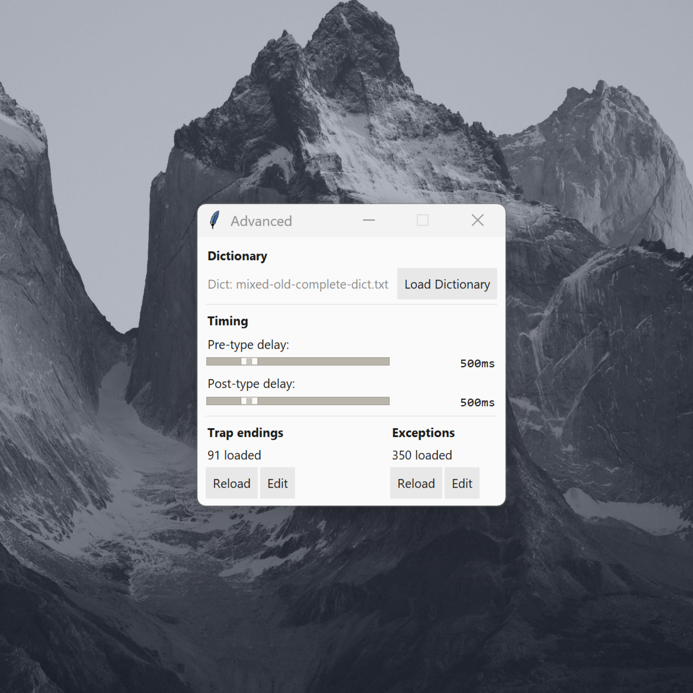
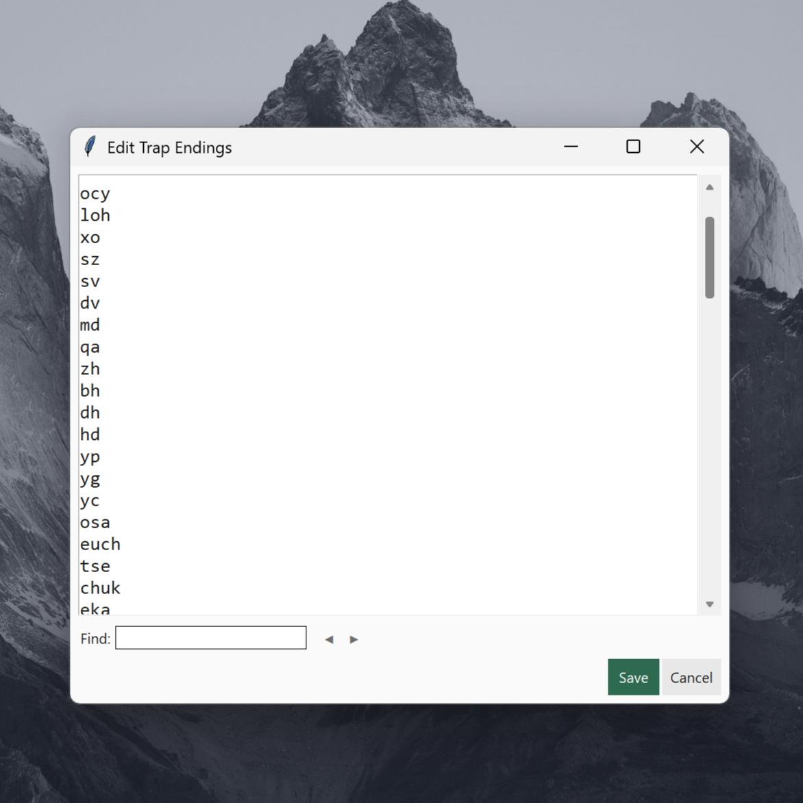

# Letter Demon 😈

Search-and-autotype tool for a Shiritori-style Roblox word game.


## Features

**Strategy + Backup** — Pick a main strategy, then a fallback.

- **Trap** → Lead into a difficult to follow suffix.
- **Long** → Obscure, ridiculously long words.
- **Short** → Minimal effort.
- **Random** → Let fate decide.

**Human-like Typing** — Keystroke delays, burst-typing rhythm, and optional deliberate typos (fat-finger a QWERTY neighbor, backspace, correct letter).

**Full Control** — Block words, create custom trap endings, inline editor with search/undo, review used words, toggle suffix-only vs full-word typing.

## Installation

Windows + Python 3.10+. Run:

```bash
git clone https://github.com/n6ufal/Letter-Demon.git
cd letter-demon
pip install -r requirements.txt
python main.pyw
```

> **Note** — No in-game dictionary is included. Bring your own word list and `trap_endings.txt`.

## Quick Start

1. **Load a Dictionary** — Advanced > Load Dictionary, pick `.json` or `.txt`. Indexing ~1s.
2. **Configure Typing** — Speed (default 170ms), jitter (75%), typo intensity (4%), pre/post delays (500ms each).
3. **Pick Strategy** — Trap/Long/Short/Random + fallback.
4. **Play** — Type starting letters, press Play or Ctrl+Enter.

## Configuration

<details>
<summary><b>Dictionary Format</b></summary>

**JSON:**

```json
{ "words": ["apple", "banana", "cherry"] }
```

**Text (one per line):**

```
apple
banana
cherry
```

</details>

<details>
<summary><b>Advanced Configuration</b></summary>



**Custom Trap Endings** — Suffixes hard to continue from. Score prioritizes earlier entries. Load via Advanced > Load. Lines starting with `#` are ignored.

```
# comment
ocy
loh
sz
osa
```

> **Note:** The bundled `data/trap_endings.txt` is a dummy. Provide your own for real use.

**Word Exceptions** — Block specific words via Advanced > Edit (Exceptions section).


</details>

## Learn More

- Architecture: [ARCHITECTURE.md](docs/ARCHITECTURE.md)
- Test suite: [TESTING.md](docs/TESTING.md)
- Blog: [What Happens When You Take a Word Game Too Seriously](https://alifnaufal.me/posts/what-happens-when-you-take-a-word-game-too-seriously/)

## Constraints

This tool depends on external data to work well:

- **Dictionary** — TXT or JSON word list. [Dwyl](https://github.com/dwyl/english-words) 474k+ gets you decent coverage. The game uses an updated 477k+ list (combined from multiple sources) for the best results.
- **Trap endings** (`trap_endings.txt`) — Suffixes ranked by dead-end difficulty. Required for Trap mode to be effective.
- **Exceptions** (`exceptions.txt`) — Filters out slurs, proper nouns, and other words you don't want suggested.
- Only usable in the game's Casual mode.

## Disclaimer

Built as a personal Python learning project, for personal use only.
